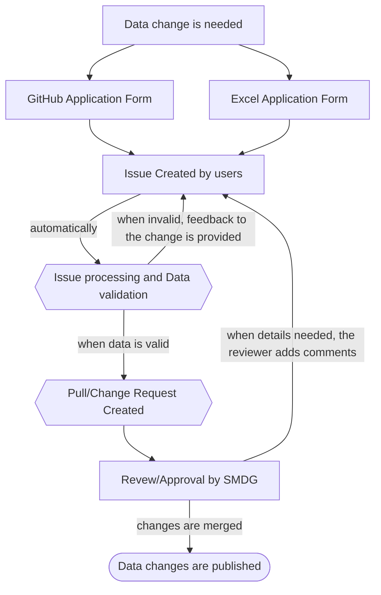
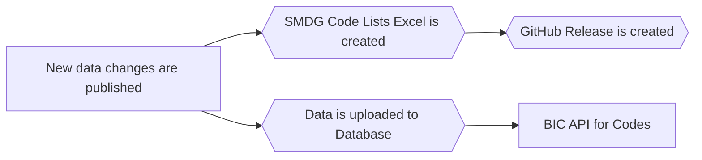
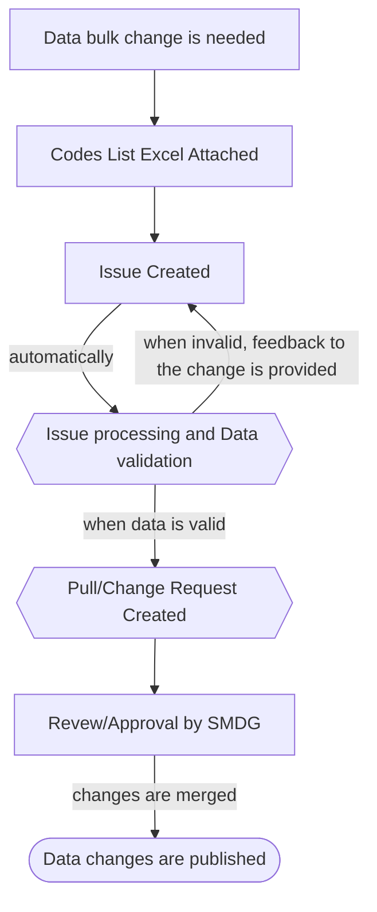

# Data Handling Flows

## Requesting Data Changes Process

The process begins when the requester creates a GitHub issue using the appropriate template: [New Issue](https://github.com/smdg-org/code-lists/issues/new/choose).

Requesters can submit their application by either:

* Filling out the GitHub application form
* Uploading an Excel application form

## Data Release Process

Once the changes are merged into the dataset, automated workflows ensure that the API is updated and a new Excel version is published under: [Releases](https://github.com/smdg-org/code-lists/releases)

## Bulk Data Update Process

This process is exclusively for the SMDG team when making changes that impact all or most SMDG codes.

The process begins when the SMDG data owner creates a GitHub issue for bulk updates using the appropriate template: [New Issue](https://github.com/smdg-org/code-lists/issues/new/choose).

